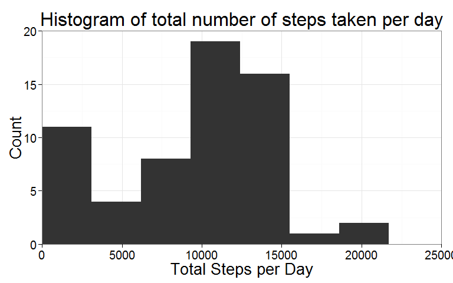
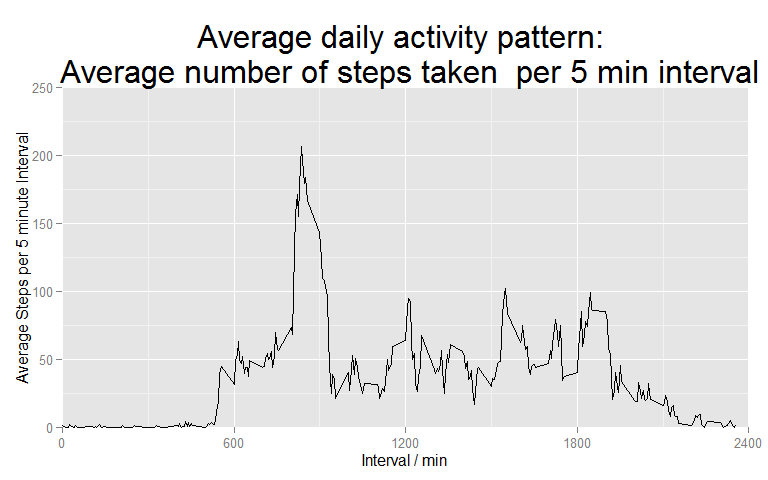
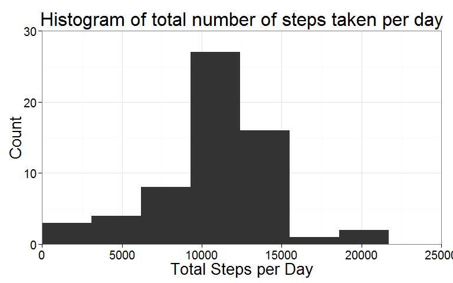
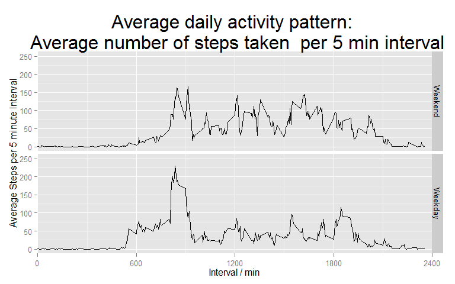

# Reproducible Research: Peer Assessment 1


## Loading and preprocessing the data

Firstly, the data set from the personal activty monitoring device (activity.zip) was uncompressed and the data read into a data frame. Dates were then transformed into date format.


```r
unzip("activity.zip")
activity <- read.csv("activity.csv")
activity <- transform(activity, date = as.Date(date, format = "%Y-%m-%d"))
```


## What is mean total number of steps taken per day?

The total number of steps taken within each day was calculated by grouping the data set by date (using the group_by function of the dplyr package), then aggregated using the summarise function to perform the sum function on the grouped data. Na.rm was set to TRUE within the sum function in order to exclude missing values.


```r
  library(dplyr)
  activity1 <- summarise(group_by(activity, date), total.steps = sum(steps, na.rm = TRUE))
```

A histogram of the total number of steps taken each day was plotted using ggplot2. Binwidth was optimised to 3100, which covered the range of the data and gave an appropriate level of granularity.   


```r
library(ggplot2)
m <- ggplot(activity1, aes(x = total.steps))+ geom_histogram(binwidth = 3100)
m <- m + scale_x_continuous(limits = c(0, 25000), expand = c(0, 0)) 
m <- m + scale_y_continuous(limits = c(0, 20), expand = c(0, 0))
m <- m +theme_bw()
m <- m + theme(plot.title = element_text(size = rel(2), vjust = 1), axis.title = element_text(size = 20), 
               axis.text = element_text(size = 15))
m <- m + ggtitle("Histogram of total number of steps taken per day") 
m <- m + xlab("Total Steps per Day") + ylab("Count")
m
```

 

The mean and median total number of steps taken per day were found with the appropriate functions. 


```r
mean(activity1$total.steps)
```

```
## [1] 9354.23
```

```r
median(activity1$total.steps)
```

```
## [1] 10395
```


## What is the average daily activity pattern?

The number of steps taken within each interval of the day, averaged across the period of observation, was calculated by grouping the data set by interval, then aggregating using the summarise function to call the mean function on the grouped data. Na.rm was set to TRUE within the mean function in order to exclude missing values.

This was then plotted as a line graph using ggplot2.


```r
library (dplyr); library(ggplot2)
activity2 <- summarise(group_by(activity, interval), avg.steps = mean(steps, na.rm = TRUE))
n <- ggplot(activity2, aes(x = interval, y = avg.steps)) + geom_line()
n <- n + scale_x_continuous(limits = c(0, 2400), breaks = seq(0, 2400, 600), expand = c(0,0))  
n <- n + scale_y_continuous(limits = c(0, 250), expand = c(0,0)) 
n <- n + theme(plot.title = element_text(size = rel(2)))
n <- n + ggtitle("Average daily activity pattern: \n Average number of steps taken  per 5 min interval")
n <- n + xlab("Interval / min") + ylab("Average Steps per 5 minute Interval")
n
```

 

The 5-minute interval, which on average across all the days in the dataset, contained the maximum number of steps was returned by finding the maximum value of average steps in the data frame.


```r
maxinterval <- activity2[activity2$avg.steps == max(activity2$avg.steps), 1]
maxinterval
```

```
## Source: local data frame [1 x 1]
## 
##   interval
## 1      835
```

## Imputing missing values

The numer of rows in the original dataset containing NAs is found by:


```r
sum(is.na(activity$steps))
```

```
## [1] 2304
```

A new data set (activity3) was created from the original data set (activity), and NA values were replaced by substituting the average value for the corresponding time interval (from data set activity2).   


```r
activity3 <- activity
for(i in 1:length(activity3[,1])){
  if (is.na(activity3[i, 1]) == TRUE) {
    activity3[i, 1] <- activity2[which(activity2$interval == activity3[i, 3] ), 2]
  }
}
```

For the new data set, the total number of steps taken within each day was calculated in the same way as previously, and a histogram was plotted.


```r
library (dplyr); library(ggplot2)
activity4 <- summarise(group_by(activity3, date), total.steps = sum(steps, na.rm = TRUE))
p <- ggplot(activity4, aes(x = total.steps))+ geom_histogram(binwidth = 3100)
p <- p + scale_x_continuous(limits = c(0, 25000), expand = c(0, 0)) 
p <- p + scale_y_continuous(limits = c(0, 30), expand = c(0, 0))
p <- p +theme_bw()
p <- p + theme(plot.title = element_text(size = rel(2), vjust = 1), axis.title = element_text(size = 20), 
               axis.text = element_text(size = 15))
p <- p + ggtitle("Histogram of total number of steps taken per day") 
p <- p + xlab("Total Steps per Day") + ylab("Count")
p
```

 

The mean and median number of steps taken within a day both increase in the data set with imputed NA values. The most significant effect of imputting values for NAs has been decreasing the number of days with a total of zero steps recorded, from 8 to 0.  These 8 days with zero total steps recorded had NA values recorded for all time intervals. In essence, these "missing" days have been replaced by the "average" day computed from the remaining data.    


```r
mean(activity4$total.steps)
```

```
## [1] 10766.19
```

```r
median(activity4$total.steps)
```

```
## [1] 10766.19
```


## Are there differences in activity patterns between weekdays and weekends?

From the data set with imputed values, an additional column was added with a factor describing whether the date corresponds to a weekday or a weekend. First, the day of the week was returned using the weekdays fuction. The days of the week were then replaced by the term "Weekend" (if Saturday or Sunday) or "Weekday", and the column was converted to a factor.


```r
activity5 <- mutate(activity3, day =  weekdays(activity3$date[1:length(activity3$date)]))
for (i in 1:length(activity5$day)) {
    if ((activity5$day[i] %in% c("Saturday", "Sunday")) == TRUE) {
      activity5$day[i] <- ("Weekend")    
    }
    else {
      activity5$day[i] <- ("Weekday")
    }}
activity5$day <- factor(activity5$day, levels = c("Weekend", "Weekday"))
```

The data set with imputed data was grouped by interval and day (weekend/weekday) and the average number of steps taken within each 5 minute interval was calculated. The average number of steps taken within each interval was plotted for weekends and weekdays using ggplot2.


```r
library (dplyr); library(ggplot2)
activity6 <- summarise(group_by(activity5, interval, day), avg.steps = mean(steps, na.rm = TRUE))
q <- ggplot(activity6, aes(x = interval, y = avg.steps, group = day)) + geom_line()
q <- q + facet_grid(day ~ .)
q <- q + theme(plot.title = element_text(size = rel(2)))
q <- q + ggtitle("Average daily activity pattern: \n Average number of steps taken  per 5 min interval")
q <- q + xlab("Interval / min") + ylab("Average Steps per 5 minute Interval")
q <- q + scale_x_continuous(limits = c(0, 2400), breaks = seq(0, 2400, 600), expand = c(0,0))  
q <- q + scale_y_continuous(limits = c(0, 250)) 
q
```

 

